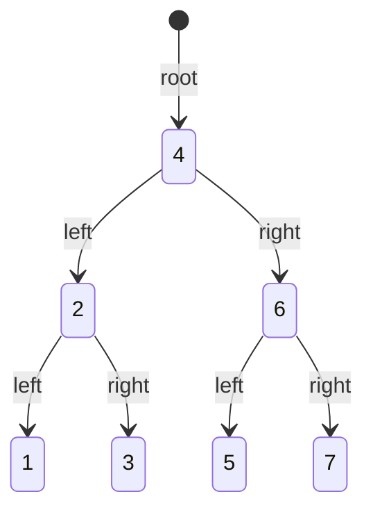
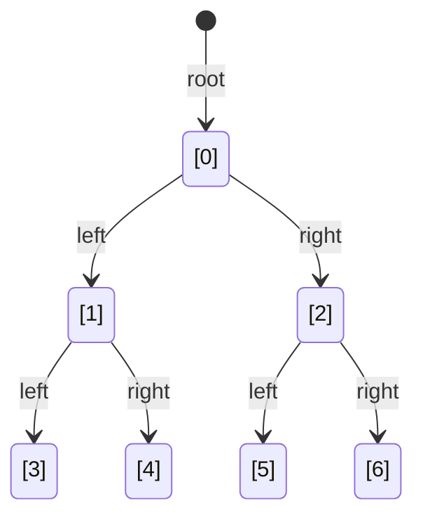

# Práctica Programada 4

| Curso                   | Estructuras de Datos                    |
| :---------------------- | :-------------------------------------- |
| Código                  | SC-304                                  |
| Profesor                | Luis Andrés Rojas Matey                 |
| Valor                   | 5 %                                     |
| Fecha y hora de entrega | Lunes 17 de noviembre antes de las 6 pm |

<br />

- [Introducción](#introducción)
- [Objetivo](#objetivo)
- [Especificaciones funcionales](#especificaciones-funcionales)
- [Especificaciones técnicas](#especificaciones-técnicas)
- [Entregables](#entregables)
- [Evaluación](#evaluación)

<br />

## Introducción

Los arreglos de tamaño fijo se pueden utilizar para generar estructuras de datos como pilas, colas y listas. Las estructuras de árboles no son la excepción.

<br />

## Objetivo

Familiarizarse con la estructura de árbol en el lenguaje de programación **Java**, creando un programa capaz de trabajar con un árbol binario ordenado representado por un arreglo fijo de enteros.

<br />

## Especificaciones funcionales

Utilizando la _Class_ `BinTreeIntArray` proveída, la cual representa un árbol binario con un arreglo de tamaño fijo de enteros, actualice los siguientes métodos:

- `insert`: agrega un nodo de tipo entero de forma ordenada.

- `preOrderTraversal`: recorre e imprime los nodos del árbol binario en preorden.

- `postOrderTraversal`: recorre e imprime los nodos del árbol binario en posorden.

Debido a que es un árbol binario ordenado, implica que todos los hijos a la izquierda de un nodo tienen un valor menor, mientras que los hijos a su derecha serán mayores.

Para representar el árbol binario en el arreglo de enteros, se utilizan las siguientes convenciones con respecto a las posiciones (índices):

- `root`: es el nodo en la posición cero (`[0]`).
- `left`: es el nodo que está en la posición `2i + 1` de su _Parent_, donde `i` representa el índice de la posición del _Parent_.
- `right`: es el nodo que está en la posición `2i + 2` de su _Parent_, donde `i` representa el índice de la posición del _Parent_.

La siguiente tabla muestra este comportamiento:

| _Node_ | _Left_ | _Right_ |
| :----: | :----: | :-----: |
|   0    |   1    |    2    |
|   1    |   3    |    4    |
|   2    |   5    |    6    |
|   3    |   7    |    8    |
|   4    |   9    |   10    |
|  ...   |  ...   |   ...   |

De esta forma, el siguiente diagrama representa el árbol binario a partir del arreglo `[4, 2, 6, 1, 3, 5, 7]`:



Lo anterior, dado sus índices:



El objetivo final es que, una vez implementados los métodos y la compilación sea correcta, al ejecutar el programa desde una consola (sin argumentos) imprima el arreglo que se va generando al ir insertando nodos y, cuando el arreglo esté lleno (el árbol está completo), se recorra e imprima según cada orden. En otras palabras, se debería ver en la consola exactamente lo siguiente:

```
$ java BinTreeIntArray

Empty array → [null, null, null, null, null, null, null]
 ↳ insert: 4 → [4, null, null, null, null, null, null]
 ↳ insert: 6 → [4, null, 6, null, null, null, null]
 ↳ insert: 5 → [4, null, 6, null, null, 5, null]
 ↳ insert: 2 → [4, 2, 6, null, null, 5, null]
 ↳ insert: 7 → [4, 2, 6, null, null, 5, 7]
 ↳ insert: 1 → [4, 2, 6, 1, null, 5, 7]
 ↳ insert: 3 → [4, 2, 6, 1, 3, 5, 7]

Full array → [4, 2, 6, 1, 3, 5, 7]
 ↳ inOrderTraversal → 1 2 3 4 5 6 7
 ↳ preOrderTraversal → 4 2 1 3 6 5 7
 ↳ postOrderTraversal → 1 3 2 5 7 6 4
```

<br />

## Especificaciones técnicas

La _Class_ `BinTreeIntArray` provista contiene ya varios componentes o elementos (atributos, constructor, métodos), por lo que se debe tomar en cuenta lo siguiente:

- El nombre de la _Class_ (`BinTreeIntArray`) no se debe modificar. Lo único permitido es incorporarla como parte de un _Package_, siempre y cuando se puede compilar y ejecutar.

- El método `main` no puede ser modificado bajo ninguna circunstancia.

- El atributo `_tree` (el arreglo de `Integer`) no puede ser modificado de ninguna forma.

- El constructor recibe el tamaño del arreglo, por lo que tampoco se debe modificar. No se pueden agregar otros constructores.

- No se pueden modificar nombres de métodos, ni sus parámetros ni su tipo de valor que retorna.

- No se debe modificar lo que imprime en consola (`System.out.print...`). Tampoco se deben agregar más.

- No es permitido utilizar los bloques de _Try/Catch/Finally_ (`try {...} catch {...} finally {...}`) para "atrapar" posibles excepciones.

- Lo único que puede actualizar son los métodos `insert`, `preOrderTraversal` y `postOrderTraversal`, específicamente lo que se indica por medio de un comentario (`// Actualizar`).

- Para insertar nodos (`insert`), así como para recorrer e imprimir el árbol (`preOrderTraversal` y `postOrderTraversal`) se deben utilizar estrategias iterativas (con bucles), por lo que no es posible usar recursividad.

- Para insertar, recorrer e imprimir, se debe hacer uso de las fórmulas expuestas anteriormente para dirigirse a los nodos `left` y `right`, es decir, `2i + 1` y `2i + 2` respectivamente

- Note que el arreglo vacío contiene elementos tipo `null`, esto debido a que se está utilizando la _Class_ tipo `Integer` en vez de su valor primitivo (`int`).

- La versión para desarrollar la práctica debe ser [**_Java SE 21 & JDK 21_**](https://docs.oracle.com/en/java/javase/21/docs/api/index.html) (_Standard Edition & Java Development Kit version 21)_, la cual es [LTS](<https://en.wikipedia.org/wiki/Java_version_history#Java_SE_21_(LTS)>) (_Long-Term Support_). Se recomienda utilizar la implementación de [OpenJDK](https://jdk.java.net/java-se-ri/21) o de [Oracle](https://www.oracle.com/java/technologies/downloads/#java21).

<br />

## Entregables

Esta es una práctica individual, por lo que en el apartado indicado del **Campus Virtual** (con un archivo comprimido **ZIP**) o en su respectivo repositorio de **Git**, específicamente en el _Branch_ principal (`main`), debe hallarse una carpeta llamada `PP4`, la cual contenga:

- Todo el código fuente. Sin embargo, no debe contener los archivos compilados, es decir, excluir cualquier archivo `.class`.

  - Puede copiar el archivo [`.gitignore`](https://github.com/larmcr/2025-III-SC-304/blob/main/.gitignore) del [repositorio del profesor](https://github.com/larmcr/2025-III-SC-304) en la raíz de su repositorio para excluir los archivos `.class`.

- Un archivo de documentación llamado `README.md`, hecho en [Markdown](https://www.markdownguide.org) con su respectiva sintaxis, donde se indique lo siguiente:

  - Su nombre y carné.

  - El IDE o editor utilizado.

  - Páginas web donde halló posibles soluciones a problemas encontrados o _Snippets_ de código.

  - _Prompts_ (consultas y respuestas) de los chatbots de IA (**Copilot**, **Gemini**, **ChatGPT**, etc.) que haya utilizado.

    - Este puede ser el vínculo compartido de dicho(s) chatbot(s).

<br />

## Evaluación

La siguiente tabla muestra los rubros a evaluar, siempre y cuando el proyecto compile correctamente; así mismo, en caso de no compilar satisfactoriamente, se evaluará como que no fue entregado, es decir, con cero puntos.

|       | Rubros                      | Puntos |
| :---: | :-------------------------- | :----: |
| **A** | Estructura <sup>1</sup>     |   1    |
| **B** | Método `insert`             |   2    |
| **C** | Método `preOrderTraversal`  |   2    |
| **D** | Método `postOrderTraversal` |   2    |
| **E** | Documentación               |   3    |
|       | **Total**                   | **10** |

1. Ejemplo de estructura:

```
Repositorio [directorio con su número de carné]
└── PP4 [directorio con nombre obligatorio]
    ├── BinTreeIntArray.java [archivo proveído]
    └── README.md [documentación]
```
